# Práctica 6.3 - Despliegue de servidores web con usuarios autenticados mediante LDAP usando Docker y docker-compose

La ip usada en esta práctica ha sido 192.168.91.192

## Despliegue con Docker de NGINX + demonio de autenticación LDAP + OpenLDAP

Para comenzar nos conectamos por medio de ssh a la máquina con la ip ya mencionada. Creamos la siguiente estructura de directorios:

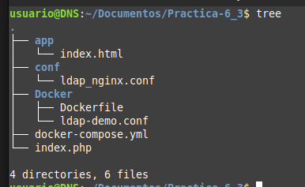

Ahora modificamos el arhcivo html que se mostrará en el servidor web:

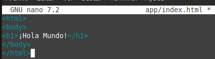

Ahora toca configurar el archivo nginx, de forma que vamos a modificar el archivo ldap_nginx.conf:

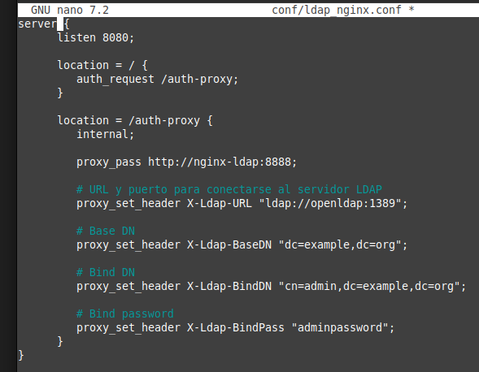

Hemos configurado el puerto 8082 para que no halla conflicto con el puerto 8080 que ya está en uso. Podemos ver que se ha configurado la autenticación LDAP conectando con 
el servidor openldap.

Ahora ya estamos en condiciones de crear el archivo docker-compose.yml:

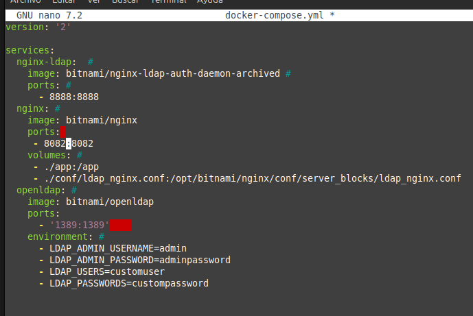

Levantamos los contenedores con el comando `docker-compose up -d` y comprobamos que todo está correcto:

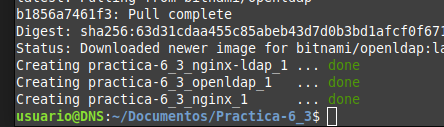

Y si todo esta bien haciendo una petición a la ip de la máquina con el puerto 8082:

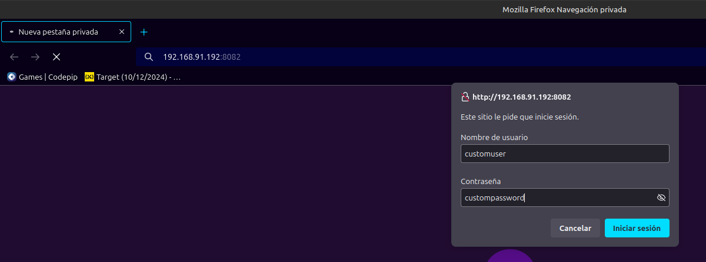

Debería aparecer esta página de autenticación.

## Despliegue con Docker de PHP + Apache con autenticación LDAP

Ahora vamos a continuar creando el archivo index.php en la raiz de directorios mostrada anteriormente:

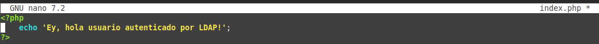

Basandonos en la plantilla proporcionada rellenamos el Dockerfile de la caperta Docker, dejandolo de la siguiente manera:

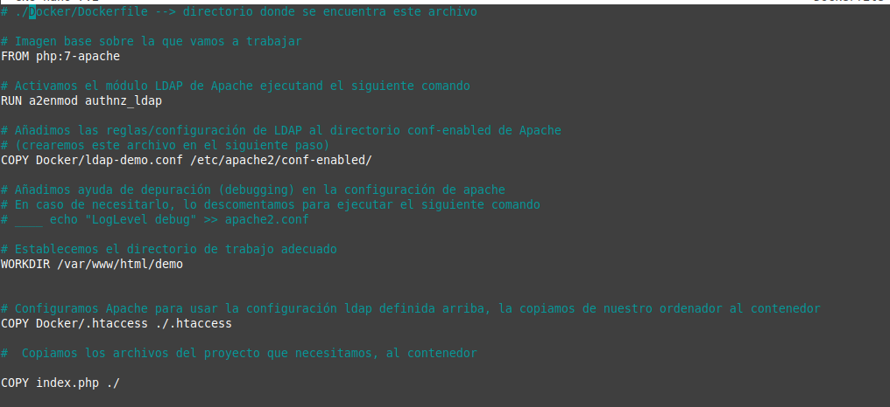

Creamos ahora el archivo ldap-demo.conf en el directorio Docker:

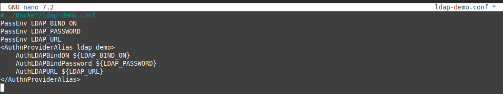

Por último creamos el archivo .htaccess en el directorio Docker:

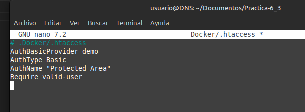

Ya estamos en condiciones de construir la imagen: 

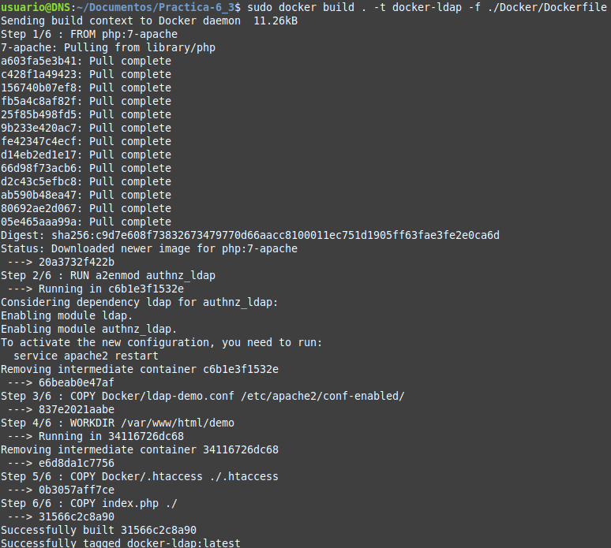

Una vez comprobado que todo va adecuadamente, levantamos el contenedor:

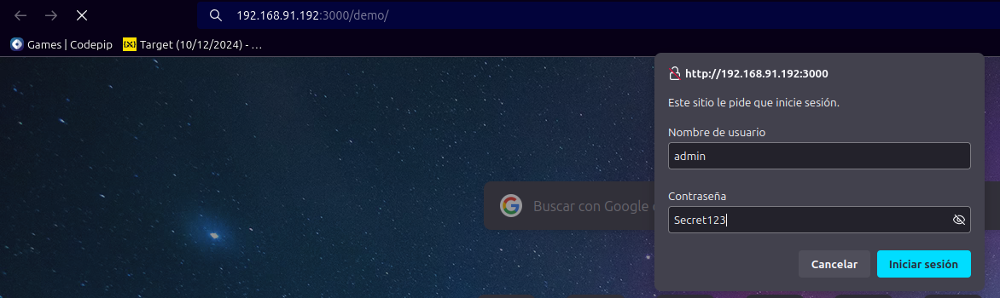

Y comprobamos que todo está correcto hacinedo una petición al recurso demo de la ip de la máquina con el puerto 3000:

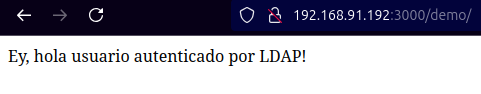